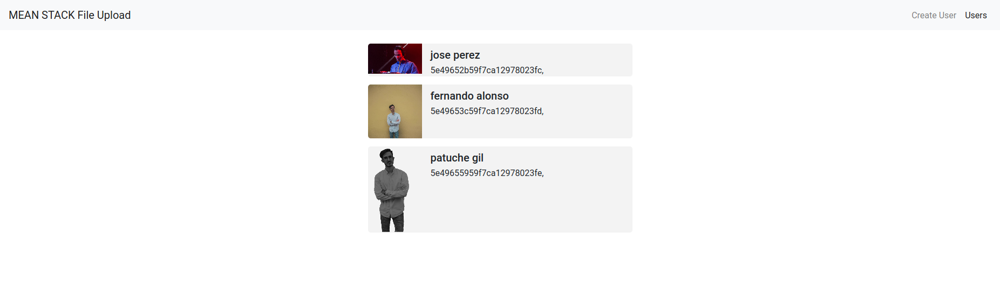

* Debemos cambiar la ip del servidor en  file-upload.service.ts.

  ```Ejemplo:   baseURL = "http://192.168.178.180:3000/api";```
  
* Tambien tenemos que cambiar el puerto en backend/server.js;

  ```Ejemplo: const port = process.env.PORT || 3000 ;```



# mean-stack-file-upload
Angular 8 & Express File Upload Tutorial with Reactive Forms -  Learn to upload files and images in Angular MEAN Stack project using Multer NPM module.

## Step by Step Tutorial
[Angular 8 & Express File Upload Tutorial with Reactive Forms](https://www.positronx.io/angular-8-express-file-upload-tutorial-with-reactive-forms/)

## How to run the app?
- Run `npm install` to install required dependencies.
- Run `ng serve` to run the angular app
- Start the MEAN Stack backend
  - `cd backend` to enter into the backend folder
  - `nodemon server` to start the nodemon server
  - `mongod` to start the mongoDB shell
